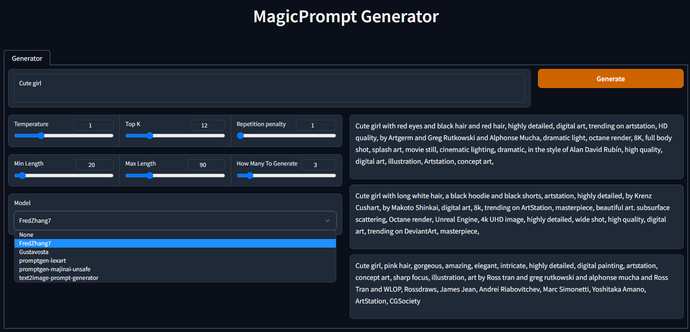

# MagicPrompt Generator

Prompt Generator for Stable Diffusion/Midjourney on GPT-2 models

Includes model:
- FredZhang7/distilgpt2-stable-diffusion-v2
- Gustavosta/MagicPrompt-Stable-Diffusion
- AUTOMATIC/promptgen-lexart
- AUTOMATIC/promptgen-majinai-unsafe
- succinctly/text2image-prompt-generator

## How to use

Run launch.bat (windows) or launch.sh (linux)

To add models, modify the `models.yaml` file.

Based on @RassilonSleeps and @Gustavosta
